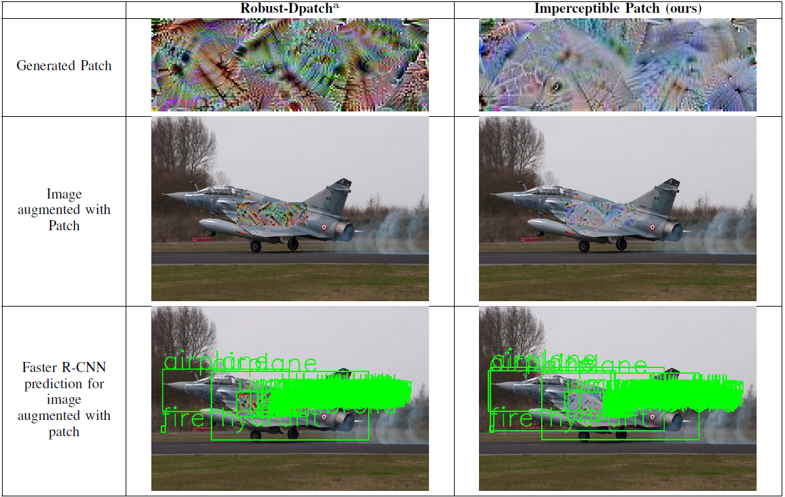

# Developing Imperceptible Adversarial Patches to Camouflage Military Assets From Computer Vision Enabled Technologies

### How to use:
#### Install required files:
```bash
sudo pip install -r requirements.txt
```
#### Move to root project folder: 
```bash
mv ./github/imperceptible_patch_generator
```
#### Run:
```bash
./execute_imperceptible_patch
```
#### Results:
```bash
mv ./code/experiment_data
```
####
### Credit
The code has adapted two libraries:
####
https://github.com/Trusted-AI/adversarial-robustness-toolbox 
####
https://github.com/ZhengyuZhao/PerC-Adversarial
